# AI Gateway / RAG / Memory 선수지식 입문서

이 문서는 AI Gateway, RAG, Memory 같은 주제를 공부하기 전에 필요한 기반 지식을 한 흐름으로 정리한 입문용 학습서다. 특정 프로젝트를 설명하기 위한 문서가 아니라, 처음 이 주제를 접하는 개발자가 네트워크, Kubernetes, 프록시, LLM, Agent, 운영성까지 연결해서 이해할 수 있도록 돕는 것을 목표로 한다.

독자는 개발 입문 3개월 정도로 가정한다. Docker는 조금 써봤지만 Kubernetes와 네트워크는 체계적으로 배우지 않았고, LLM과 RAG, Memory도 이름만 들어본 정도를 기준으로 설명한다.

## 목차

1. [AI 시스템을 보기 위한 큰 그림](#1-ai-시스템을-보기-위한-큰-그림)
2. [컴퓨터 네트워크 기초](#2-컴퓨터-네트워크-기초)
3. [프록시, 로드밸런서, Gateway 기초](#3-프록시-로드밸런서-gateway-기초)
4. [컨테이너와 Kubernetes 기초](#4-컨테이너와-kubernetes-기초)
5. [LLM 기본 동작](#5-llm-기본-동작)
6. [Agent와 Tool Calling](#6-agent와-tool-calling)
7. [MCP와 권한, 도구 노출](#7-mcp와-권한-도구-노출)
8. [RAG 기본기](#8-rag-기본기)
9. [Memory 기본기](#9-memory-기본기)
10. [AI Gateway와 운영성](#10-ai-gateway와-운영성)
11. [기술 검증과 실험 설계](#11-기술-검증과-실험-설계)
12. [전체 연결 요약](#12-전체-연결-요약)
13. [부록: 핵심 용어집](#13-부록-핵심-용어집)
14. [부록: 자주 헷갈리는 비교표](#14-부록-자주-헷갈리는-비교표)

---

## 1. AI 시스템을 보기 위한 큰 그림

### 왜 배우는가

AI 시스템을 처음 배우면 보통 "모델 API를 호출해서 답을 받는 기능" 정도로 이해하기 쉽다. 하지만 실제 서비스에서는 모델 하나만 잘 붙인다고 끝나지 않는다. 요청이 어디로 들어오는지, 어떤 규칙으로 제어되는지, 외부 정보를 어떻게 가져오는지, 무엇을 기억할지, 장애가 나면 어디를 봐야 하는지까지 함께 생각해야 한다.

이 장의 목적은 뒤에서 나올 네트워크, Kubernetes, LLM, RAG, Memory, Gateway를 하나의 큰 그림으로 먼저 묶어 보는 것이다.

### 먼저 알아야 할 용어

- `클라이언트`: 요청을 보내는 쪽이다. 브라우저, 모바일 앱, 다른 서버 모두 될 수 있다.
- `서버`: 요청을 받아 처리하고 응답하는 쪽이다.
- `모델`: 입력을 바탕으로 출력을 생성하는 AI 구성요소다.
- `플랫폼`: 여러 서비스가 공통으로 쓰는 기능과 규칙을 제공하는 계층이다.

### 핵심 설명

간단한 웹 서비스는 보통 `사용자 -> 앱 서버 -> 데이터베이스` 정도의 구조로 이해할 수 있다. 그런데 AI 기능이 들어가면 다음 요소가 추가된다.

- 어떤 모델을 선택할지 결정하는 라우팅
- 외부 도구나 내부 시스템을 호출하는 흐름
- 문서를 검색해 문맥을 보강하는 RAG
- 사용자와의 장기 문맥을 관리하는 Memory
- 비용, 속도, 정책, 로그를 추적하는 운영 계층

그래서 AI 시스템은 단순 텍스트 생성 기능보다 훨씬 넓은 문제를 다룬다. 모델은 그중 하나일 뿐이다.

### 기본 흐름

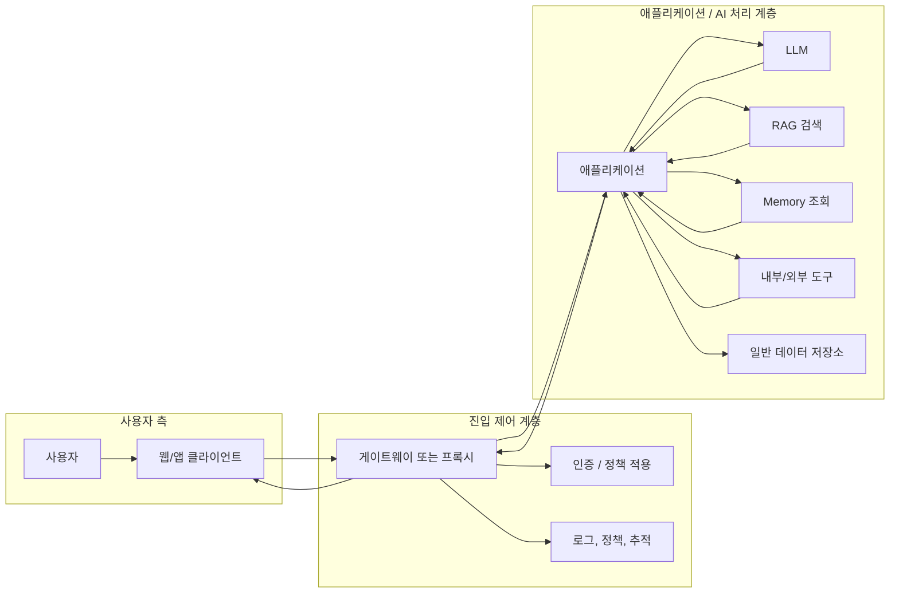

### 헷갈리기 쉬운 비교

| 개념 | 주된 질문 | 역할 |
| --- | --- | --- |
| 네트워크 | 요청이 어떻게 이동하는가 | 통신 기반 |
| 프록시 / Gateway | 요청을 어디서 통제할 것인가 | 중간 제어 |
| LLM | 응답을 어떻게 생성할 것인가 | 생성 엔진 |
| RAG | 필요한 지식을 어디서 가져올 것인가 | 외부 지식 보강 |
| Memory | 앞으로도 기억할 문맥은 무엇인가 | 지속 문맥 관리 |
| 운영성 | 비용과 속도, 장애를 어떻게 관리할 것인가 | 서비스 안정성 |

### 작은 예시

사용자가 "내가 지난번에 선호한 답변 방식에 맞춰서, 최신 문서를 참고해 설명해줘"라고 요청한다고 생각해 보자.

- 최신 문서는 RAG의 대상이다.
- 지난번 선호는 Memory의 대상이다.
- 실제 응답은 LLM이 만든다.
- 그 요청이 어떤 모델을 쓸지, 사용량을 얼마나 허용할지는 Gateway나 운영 정책의 관심사다.

### 장 요약

- AI 시스템은 모델 하나가 아니라 여러 계층이 함께 작동하는 구조다.
- RAG, Memory, Gateway, 운영성은 모두 서로 연결되어 있다.
- 큰 그림을 먼저 잡아야 뒤 장들이 따로 놀지 않는다.

---

## 2. 컴퓨터 네트워크 기초

### 왜 배우는가

AI Gateway나 Envoy를 이해하려면 먼저 네트워크의 기본이 필요하다. 특히 L3, L4, L7 같은 표현은 프록시와 Gateway 문맥에서 아주 자주 등장한다. 이 장에서는 운영과 연결되는 수준까지 네트워크를 정리한다.

### 먼저 알아야 할 용어

- `IP`: 네트워크에서 대상을 식별하기 위한 주소다.
- `Port`: 한 컴퓨터 안에서 어떤 프로그램과 통신할지 구분하는 번호다.
- `Protocol`: 통신 규칙이다.
- `Connection`: 둘 사이에 통신 상태가 어느 정도 유지되는 관계다.
- `DNS`: 이름을 IP 주소로 바꿔 주는 시스템이다.

### 핵심 설명

#### 클라이언트와 서버

인터넷에서 통신은 보통 클라이언트가 요청을 보내고 서버가 응답하는 형태로 시작한다. 브라우저가 웹사이트를 여는 것도, 앱이 API를 호출하는 것도 이 구조다.

여기서 같이 알아두면 좋은 가장 기본적인 말들이 있다.

- `요청(Request)`: 클라이언트가 서버에 보내는 메시지다.
- `응답(Response)`: 서버가 요청 처리 결과로 돌려주는 메시지다.
- `엔드포인트(Endpoint)`: 서버가 특정 기능을 제공하는 접점이다. 예를 들어 `/users` 같은 경로를 떠올리면 된다.

#### IP, Port, Protocol

IP는 어느 장비와 통신할지 알려준다. Port는 그 장비 안의 어떤 프로그램이 요청을 받을지 알려준다. Protocol은 어떤 규칙으로 통신할지를 정한다.

예를 들어 `https://example.com`에 접속할 때는 다음 일이 일어난다.

1. DNS가 `example.com`을 IP로 바꾼다.
2. 클라이언트는 그 IP의 특정 포트로 연결을 시도한다.
3. HTTPS 규칙에 따라 요청을 보낸다.

#### TCP와 UDP

TCP는 상대적으로 신뢰성 있는 전송을 목표로 한다. 순서 보장, 재전송, 연결 개념이 중요하다. HTTP/1.1과 HTTP/2는 보통 TCP 위에서 동작한다.

UDP는 더 가볍고 빠르지만 신뢰성을 직접 보장하지 않는다. 실시간 스트리밍, 게임, DNS 일부 질의처럼 빠른 전달이 중요한 곳에서 자주 쓰인다. 다만 HTTP/3는 UDP 기반의 QUIC 위에서 동작한다. 따라서 "HTTP는 항상 TCP 위에서 동작한다"라고 외우기보다는, "전통적인 웹 통신은 TCP를 많이 써 왔고 최신 표준에서는 UDP 기반 전송도 사용한다" 정도로 이해하는 편이 더 정확하다.

#### DNS

사람은 이름을 기억하기 쉽고, 컴퓨터는 IP를 사용한다. DNS는 그 사이를 연결해 준다. 서비스가 여러 서버로 분산되거나 인프라가 바뀌어도 이름을 유지할 수 있게 해 주는 중요한 구성요소다.

#### HTTP와 HTTPS

HTTP는 웹에서 많이 쓰는 요청/응답 프로토콜이다. HTTPS는 HTTP에 암호화를 추가한 형태다. 오늘날 대부분의 서비스는 HTTPS를 기본으로 쓴다.

HTTP를 볼 때는 아래 용어도 같이 알아두면 좋다.

- `URL`: 어디로 요청을 보낼지 나타내는 주소 문자열이다.
- `Host`: 어느 서버를 대상으로 하는지 나타내는 이름이다.
- `Path`: 그 서버 안에서 어떤 기능이나 자원을 요청하는지 나타내는 경로다.
- `Method`: 어떤 종류의 작업을 원하는지 나타낸다. 예를 들어 `GET`, `POST`, `PUT`, `DELETE`가 있다.
- `Header`: 요청이나 응답에 붙는 부가 정보다. 인증 정보, 콘텐츠 형식 같은 것이 들어간다.
- `Body`: 실제 본문 데이터다. JSON payload가 여기 들어가는 경우가 많다.
- `Status Code`: 서버가 요청 처리 결과를 숫자로 알려주는 방식이다. `200`, `404`, `500` 같은 값이 대표적이다.

입문 단계에서는 "URL로 대상과 경로를 정하고, Method로 의도를 표현하고, Header와 Body에 필요한 정보를 담아 보내며, 응답은 Status Code와 함께 돌아온다" 정도로 이해하면 충분하다.

#### REST API, RESTful API, gRPC

웹과 서버 통신 방식을 이야기할 때 자주 나오는 표현이다.

- `REST API`: HTTP의 자원, 메서드, 상태 코드 같은 개념을 활용해 설계한 API 스타일을 가리키는 경우가 많다.
- `RESTful API`: REST의 원칙을 비교적 잘 따르는 API를 강조할 때 쓰는 표현이다. 실무에서는 REST API와 거의 섞어서 쓰지만, 엄밀히는 "REST스럽게 잘 설계되었는가"를 더 강조하는 말로 볼 수 있다.
- `gRPC`: HTTP/2를 기반으로 동작하는 RPC 방식의 통신 기술이다. 주로 서비스 간 내부 통신에서 높은 성능과 명확한 인터페이스가 필요할 때 많이 쓴다.

입문자 관점에서는 "REST는 사람이 읽기 쉬운 HTTP API 스타일", "gRPC는 서비스 간 통신에 자주 쓰이는 고성능 호출 방식" 정도로 먼저 이해해도 충분하다.

#### Stateful와 Stateless

Stateless는 각 요청이 서로 독립적이라는 뜻이다. 서버는 이전 요청을 반드시 기억하지 않아도 된다. HTTP는 기본적으로 stateless한 철학을 가진다.

Stateful은 이전 상호작용 상태가 현재 처리에 영향을 주는 경우다. 로그인 세션, 소켓 연결, 장기 대화 문맥, 사용자 Memory는 stateful한 성격이 있다.

#### Timeout, Retry, Connection

운영 관점에서 중요한 기본 개념이다.

- `Timeout`: 얼마나 기다리다가 실패로 판단할지
- `Retry`: 실패했을 때 다시 시도할지
- `Connection`: 한 번 맺은 통신 경로를 유지해 재사용할지

AI 시스템에서는 모델 호출이 느리거나 외부 도구가 불안정할 수 있어 이 개념들이 특히 중요하다.

### TCP/IP 모델과 OSI 7계층

네트워크를 공부할 때 가장 많이 헷갈리는 부분 중 하나다. 두 모델은 경쟁 관계가 아니라, 서로 다른 목적을 가진 설명 틀이라고 보는 편이 맞다.

`OSI 7계층`은 네트워크 통신을 이해하기 쉽게 나눠 설명한 추상적인 참조 모델이다. 교육용, 설명용, 분류용으로 매우 유용하다. 반면 `TCP/IP 모델`은 실제 인터넷 프로토콜들이 동작하는 방식에 더 가까운 실용적인 모델이다. 즉, OSI 7계층은 "이론적으로 어떻게 나눠 생각할 수 있는가"에 가깝고, TCP/IP는 "현실에서 어떻게 구현되고 사용되는가"에 더 가깝다.

입문자 관점에서는 아래처럼 이해하면 충분하다.

- `OSI 7계층`: 개념을 잘게 나눠서 설명하는 지도
- `TCP/IP 모델`: 실제 인터넷이 움직이는 방식에 가까운 현실 모델

보통 TCP/IP 모델은 아래처럼 단순화해서 본다.

- `Link 계층`: 같은 네트워크 안에서 데이터가 오가는 부분
- `Internet 계층`: IP를 이용해 어디로 보낼지 결정하는 부분
- `Transport 계층`: TCP, UDP처럼 종단 간 전달 방식을 다루는 부분
- `Application 계층`: HTTP, DNS, gRPC처럼 애플리케이션이 직접 사용하는 프로토콜이 있는 부분

OSI 7계층과 TCP/IP 모델은 1:1로 완벽하게 대응하지는 않지만, 대략적으로는 아래처럼 이해할 수 있다.

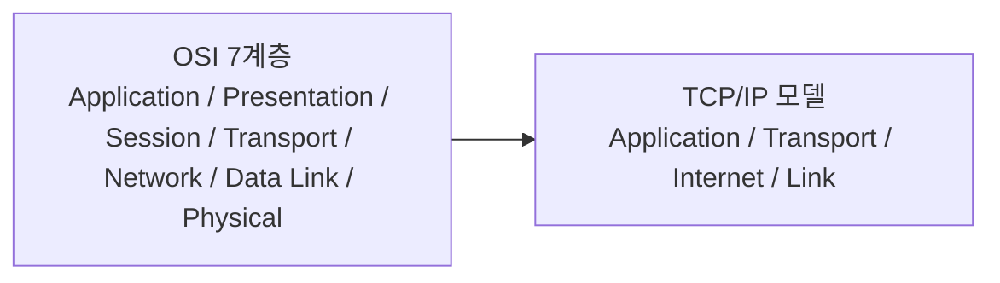

즉, OSI의 위쪽 여러 계층은 TCP/IP의 Application 계층 쪽으로 합쳐져 이해되는 경우가 많고, 아래쪽도 더 단순한 형태로 묶여 보인다.

중요한 결론은 이렇다.

- OSI 7계층은 추상적이고 설명용이다.
- TCP/IP 모델은 실제 구현과 인터넷 프로토콜 관점에 더 가깝다.
- 실무에서 L3, L4, L7 같은 표현을 자주 쓰는 것은 OSI식 번호 체계를 빌려서 "어느 수준까지 이해하고 제어하느냐"를 빠르게 말하기 편하기 때문이다.

### L3 / L4 / L7

교과서에서는 OSI 7계층을 자세히 배우지만, 실무에서는 보통 L3, L4, L7 정도만 자주 언급한다.

- `L3`: IP 주소를 보고 어디로 보낼지 결정하는 계층
- `L4`: Port와 전송 계층 정보를 기준으로 연결을 다루는 계층
- `L7`: HTTP 메서드, 경로, 헤더, 쿠키, 호스트 이름처럼 애플리케이션 데이터를 이해하는 계층

즉, 계층 숫자가 커질수록 더 높은 수준의 의미를 볼 수 있다.

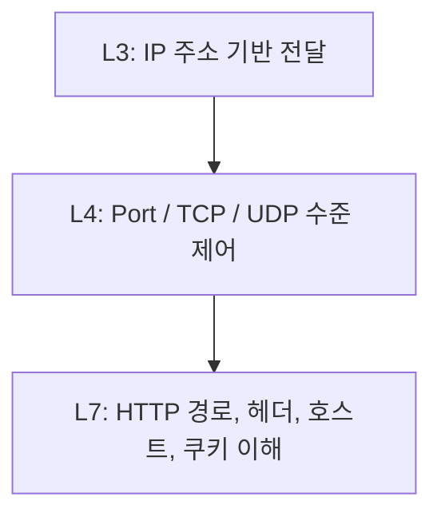

L3 장비는 "어느 주소로 갈까"를 본다. L4 장비는 "어느 연결과 포트로 보낼까"를 본다. L7 장비는 "이 요청이 `/chat` 경로로 들어왔고 Authorization 헤더가 있고 특정 호스트를 대상으로 한다" 같은 수준까지 이해할 수 있다.

### 헷갈리기 쉬운 비교

| 개념 | 무엇을 보나 | 예시 |
| --- | --- | --- |
| L3 | IP 주소 | 어느 서버 대역으로 갈지 |
| L4 | Port, TCP/UDP | 443 포트로 갈지, 어떤 연결을 쓸지 |
| L7 | HTTP 내용 | `/v1/chat` 요청인지, 헤더가 무엇인지 |

### 작은 예시

같은 443 포트라도 L4 수준에서는 "443 포트로 가는 연결"만 보인다. 하지만 L7 수준에서는 "이 요청은 `/admin` 경로로 가므로 막아야 한다" 같은 정책을 적용할 수 있다.

### 장 요약

- 네트워크의 기본은 IP, Port, Protocol이다.
- TCP와 UDP는 전달 방식이 다르다.
- L3, L4, L7은 무엇을 보고 제어하는지가 다르다.
- AI Gateway와 Envoy를 이해하려면 L7 수준의 사고가 필요하다.

---

## 3. 프록시, 로드밸런서, Gateway 기초

### 왜 배우는가

AI Gateway를 이해하려면 먼저 "Gateway가 다른 중간 계층과 어떻게 다른가"를 알아야 한다. 프록시, 리버스 프록시, 로드밸런서, API Gateway는 서로 비슷해 보이지만 해결하려는 문제가 다르다.

### 먼저 알아야 할 용어

- `프록시`: 통신을 대신 중계하는 중간자다.
- `리버스 프록시`: 클라이언트 대신 서버 쪽 앞단에 서는 프록시다.
- `로드밸런서`: 요청을 여러 서버에 분산하는 구성요소다.
- `Gateway`: 공통 정책과 제어를 제공하는 진입점이다.

### 핵심 설명

#### 프록시

프록시는 한쪽 대신 요청을 전달한다. 클라이언트 쪽에 있으면 외부 인터넷 접근을 대신하는 프록시가 될 수 있고, 서버 쪽에 있으면 외부 요청을 받아 내부 서버로 넘기는 리버스 프록시가 될 수 있다.

그림으로 보면 프록시는 "클라이언트 대신 바깥과 통신하는 중간자"에 가깝다.

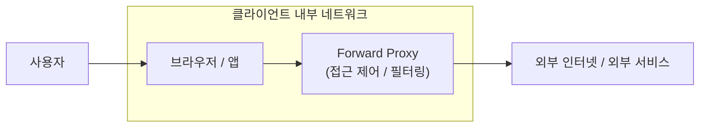

#### 리버스 프록시

리버스 프록시는 서버들 앞에 서서 요청을 받아 준다. 클라이언트는 실제 내부 서버를 직접 보지 않고, 리버스 프록시만 보게 된다. TLS 종료, 캐싱, 라우팅, 인증 일부 처리 같은 기능을 맡기 좋다.

그림으로 보면 리버스 프록시는 "서버 앞문" 역할을 한다.

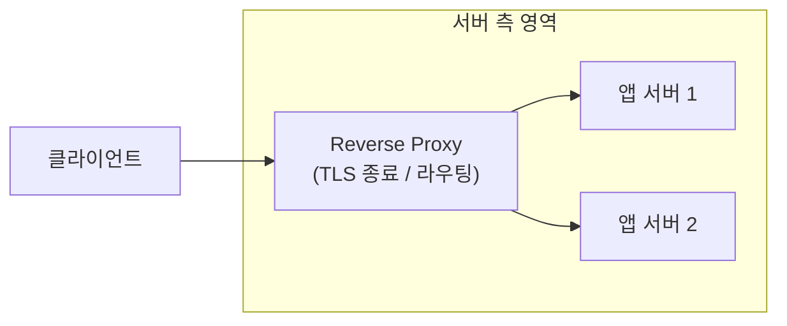

#### 로드밸런서

로드밸런서는 요청을 여러 서버에 분산한다. 서버가 여러 대일 때 한쪽으로만 몰리지 않도록 해 준다. 단순 분산만 할 수도 있고, 상태 확인과 함께 동작할 수도 있다.

그림으로 보면 로드밸런서는 "들어온 요청을 여러 서버로 나눠 보내는 분산기"다.

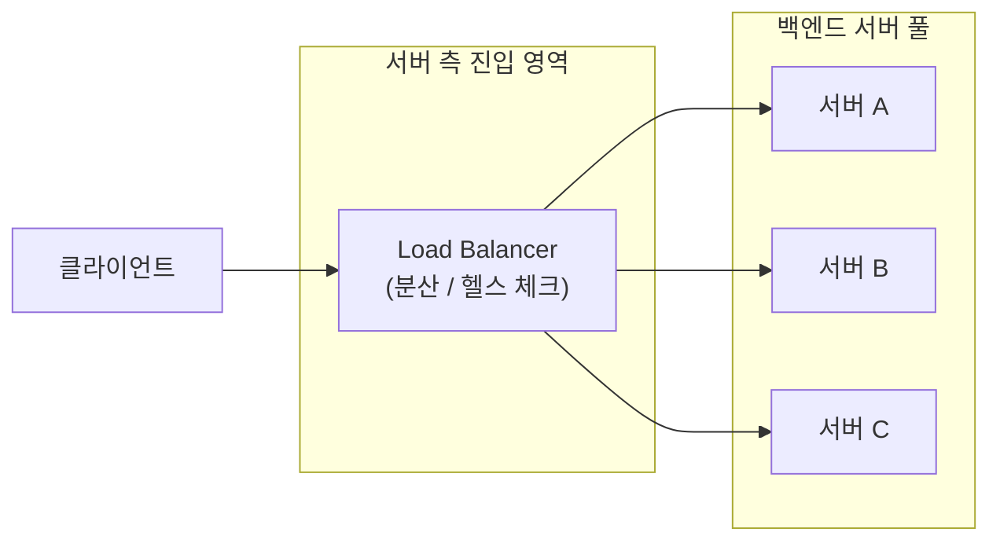

중요한 점은 리버스 프록시와 로드밸런서가 실제 제품에서 완전히 분리된 역할만 수행하는 것은 아니라는 것이다. 많은 L7 프록시 제품은 리버스 프록시이면서 동시에 로드밸런싱도 수행한다. 따라서 두 개념은 상호배타적인 제품 종류라기보다, 앞단 제어에 초점을 둔 개념과 분산에 초점을 둔 개념으로 이해하는 편이 좋다.

#### API Gateway

API Gateway는 단순 전달보다 더 많은 공통 규칙을 수행한다. 예를 들어 인증, 속도 제한, 로깅, 라우팅, 버전 관리, 정책 적용 등을 한 곳에서 처리할 수 있다.

그림으로 보면 API Gateway는 "API 공통 규칙을 모아 두는 관문"이다.

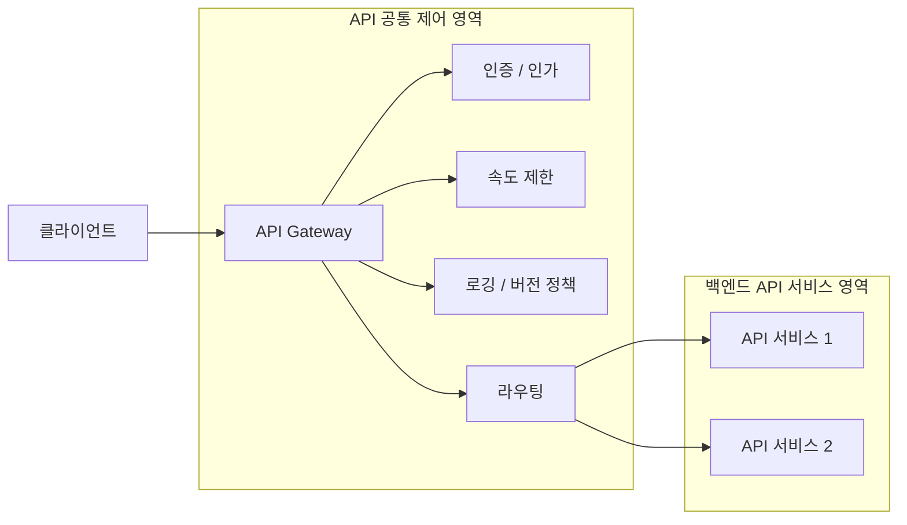

#### AI Gateway

AI Gateway는 일반 API Gateway의 생각을 AI 호출 흐름에 적용한 것이다. 모델 선택, 토큰 사용량 측정, 안전 정책, 도구 권한, 요청/응답 변형 같은 AI 특화 관심사가 추가된다.
또한 AI Gateway가 항상 검색, Memory, 도구 실행 자체를 모두 담당하는 것은 아니다. 많은 구조에서는 Gateway가 공통 정책, 관측, 인증, 라우팅을 맡고, 실제 RAG, Memory, Tool orchestration은 애플리케이션이나 에이전트 레이어가 담당한다.

그림으로 보면 AI Gateway는 "모델 호출 앞단의 운영 제어 계층"이다.

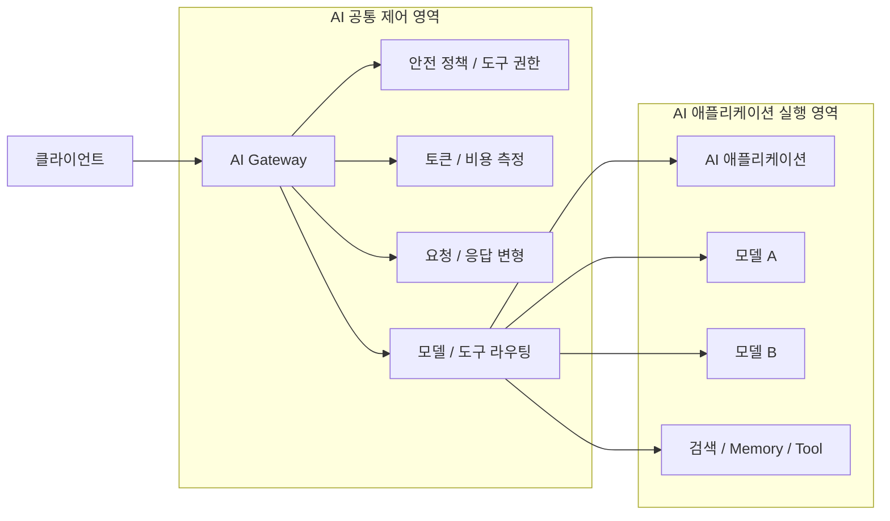

### 관계 다이어그램

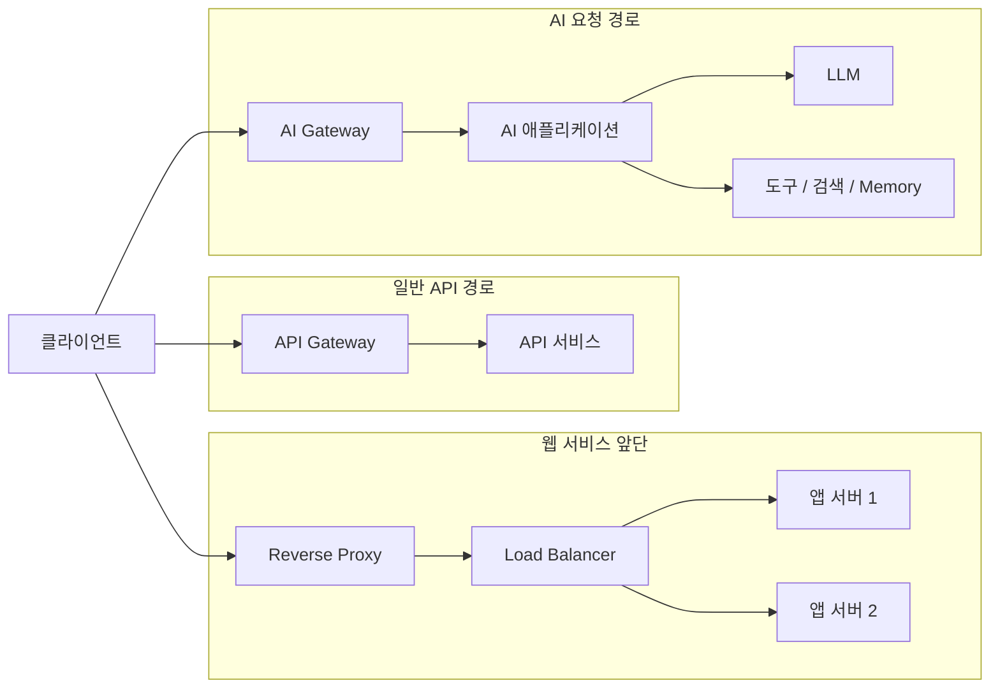

### 헷갈리기 쉬운 비교

| 구성요소 | 핵심 목적 | 보는 수준 |
| --- | --- | --- |
| 프록시 | 대신 전달 | 상황에 따라 다름 |
| 리버스 프록시 | 서버 앞단 제어 | 주로 서버 앞 |
| 로드밸런서 | 분산 | 주로 연결/대상 선택 |
| API Gateway | API 공통 정책 | L7 중심 |
| AI Gateway | AI 호출 공통 정책 | L7 + AI 운영 정보 |

### 작은 예시

일반 API에서는 "이 사용자가 초당 몇 번 호출했는가" 정도를 볼 수 있다. AI Gateway에서는 여기에 더해 "이 요청이 어떤 모델을 썼고 입력/출력 토큰이 얼마나 들었는가"도 함께 보고 싶어진다. 이것이 일반 API Gateway와 AI Gateway의 차이를 만든다.

### 장 요약

- 프록시는 대신 전달하는 중간 계층이다.
- 리버스 프록시는 서버 앞단에 서고, 로드밸런서는 분산에 집중한다.
- Gateway는 정책과 통제를 위한 공통 진입점이다.
- AI Gateway는 AI 호출에 맞는 운영 제어를 추가한 형태다.

---

## 4. 컨테이너와 Kubernetes 기초

### 왜 배우는가

AI Gateway, 앱 서버, 검색 시스템, Memory 저장소가 여러 개의 컨테이너와 서비스로 운영되는 환경에서는 Kubernetes를 자주 만나게 된다. 이 장의 목표는 Kubernetes 객체 이름을 외우는 것이 아니라, 왜 그런 객체가 필요한지 이해하는 것이다.

### 먼저 알아야 할 용어

- `컨테이너`: 애플리케이션과 실행 환경을 함께 묶은 단위다.
- `컨테이너 이미지`: 컨테이너를 실행하기 위한 설계도 같은 것이다.
- `클러스터`: 여러 머신을 묶어 하나의 운영 환경처럼 다루는 구조다.
- `노드`: 클러스터를 이루는 실제 머신 또는 가상 머신이다.
- `오케스트레이션`: 여러 컨테이너의 배포와 복구, 확장을 자동으로 관리하는 일이다.
- `매니페스트`: Kubernetes에 어떤 리소스를 만들지 적어 둔 선언형 설정 파일이다.
- `YAML`: Kubernetes 매니페스트를 자주 작성할 때 쓰는 데이터 표현 형식이다.

### 핵심 설명

#### 왜 컨테이너 오케스트레이션이 필요한가

Docker로 컨테이너 하나를 띄우는 것과, 운영 환경에서 서비스 수십 개를 안정적으로 돌리는 것은 전혀 다른 문제다. 서버가 죽었을 때 자동 복구하고, 트래픽이 늘면 늘리고, 업데이트 중단 없이 교체하고, 설정을 분리해서 관리해야 한다. 이런 문제를 해결하는 것이 오케스트레이션이고, Kubernetes는 그 대표적인 도구다.

이때 Kubernetes는 보통 "명령을 하나씩 내려서 조작하는 방식"보다 "원하는 상태를 매니페스트에 적어 두면, 시스템이 그 상태에 맞추려고 계속 조정하는 방식"으로 이해하면 쉽다. 그래서 YAML 파일로 Deployment나 Service를 선언해 두고, Kubernetes가 실제 상태를 거기에 맞추려 한다.

#### Cluster, Node, Pod

- `Cluster`: 전체 Kubernetes 환경
- `Node`: 실제로 컨테이너가 올라가는 머신
- `Pod`: Kubernetes가 배포를 다루는 가장 작은 실행 단위

Pod 안에는 보통 하나 이상의 컨테이너가 들어간다. 실무에서는 "컨테이너를 직접 배포한다"보다 "Pod를 배포한다"는 표현이 더 정확하다.

#### Replica, ReplicaSet, Deployment

서비스를 안정적으로 운영하려면 같은 Pod가 여러 개 떠 있어야 한다. 이를 위한 개념이 replica다.

- `Replica`: 원하는 Pod 개수
- `ReplicaSet`: 실제 Pod 개수를 그 수에 맞추려는 Kubernetes 객체
- `Deployment`: ReplicaSet을 관리하면서 배포 전략까지 포함하는 상위 객체

대부분의 일반 웹 서비스는 Deployment로 배포한다. 그러면 Deployment가 ReplicaSet을 만들고, ReplicaSet이 Pod 수를 유지한다.

#### Service

Pod는 죽고 새로 생길 수 있어 IP가 자주 바뀐다. 그래서 "이 Pod로 접속해라"라고 직접 말하면 운영이 불안정해진다. Service는 바뀌는 Pod 집합 앞에 안정적인 접근 지점을 제공한다.

Service가 필요한 이유는 간단하다. 애플리케이션이 "어느 Pod가 살아 있는지"를 몰라도 되게 하기 위해서다.

Service에는 자주 등장하는 기본 타입도 있다.

- `ClusterIP`: 클러스터 내부에서만 접근 가능한 기본 타입이다. 서비스 간 내부 통신에서 가장 흔하게 쓰인다.
- `NodePort`: 각 Node의 특정 포트를 통해 외부에서 접근할 수 있게 하는 방식이다. 개념 이해에는 좋지만, 실무에서는 다른 진입 계층과 함께 쓰는 경우가 많다.
- `LoadBalancer`: 클라우드 환경에서 외부 로드밸런서와 연결해 외부 진입점을 만들 때 자주 쓰인다.

즉, Service는 단순히 Pod 앞에 고정 이름을 제공하는 것에서 끝나지 않고, 어디까지 어떻게 노출할지 정하는 기본 단위이기도 하다. Ingress나 Gateway API가 필요한 이유도 Service보다 더 풍부한 외부 라우팅 규칙이 필요해지기 때문이다.

#### Ingress 또는 Gateway API

클러스터 내부 Service만으로는 외부 요청을 어떻게 받아야 할지 충분하지 않은 경우가 많다. 경로 기반 라우팅, 호스트 기반 라우팅, TLS 종료 같은 외부 진입 규칙을 다루기 위해 Ingress나 Gateway API 같은 개념이 등장한다.

#### Namespace

한 클러스터에서 리소스를 논리적으로 구분하는 공간이다. 팀, 환경, 서비스군별로 나누는 데 유용하다.

#### ConfigMap과 Secret

설정값은 코드와 분리하는 것이 좋다.

- `ConfigMap`: 일반 설정값
- `Secret`: 비밀번호, 키처럼 민감한 설정값

둘 다 설정을 주입하는 방식이지만, Secret은 더 민감한 정보라는 점이 다르다.
다만 Secret을 쓴다고 자동으로 충분한 보안이 보장되는 것은 아니다. 실제 보호 수준은 접근 권한 설정, 저장소 암호화, 외부 비밀 관리 연동 여부 같은 운영 설정에 크게 좌우된다.

#### Volume과 Persistent Volume

컨테이너는 기본적으로 쉽게 사라질 수 있다. 그런데 파일 데이터를 계속 유지해야 하는 경우가 있다. 이때 Volume을 사용한다. Persistent Volume은 그런 저장소를 더 지속적으로 다루기 위한 개념이다.

#### Health Check, Readiness, Liveness

운영에서 매우 중요하다.

- `Liveness`: 이 컨테이너를 계속 살려 둘지, 아니면 재시작이 필요한 상태인지 판단하는 기준이다.
- `Readiness`: 컨테이너가 실행 중이더라도 지금 트래픽을 받아도 되는 상태인지 판단하는 기준이다.

중요한 점은 liveness가 단순히 "프로세스가 이미 죽었는가"만 뜻하는 것은 아니라는 점이다. 컨테이너 프로세스가 살아 있어도 liveness probe가 계속 실패하면 Kubernetes는 문제가 있다고 보고 재시작할 수 있다. 반대로 readiness는 컨테이너가 살아는 있지만 아직 초기화 중이거나 의존 서비스 연결이 안 되어 있어 요청을 받으면 안 되는 상태를 나타낼 수 있다.

예를 들어 앱이 켜지긴 했지만 모델 연결 초기화가 끝나지 않았다면 readiness는 false일 수 있다. 또 앱 프로세스는 떠 있지만 내부 상태가 꼬여 정상 처리 불가능한 경우에는 liveness 실패로 재시작이 필요할 수 있다.

#### Rolling Update

새 버전으로 교체할 때 한 번에 다 꺼버리면 서비스가 끊긴다. Rolling Update는 일부를 새 버전으로 바꾸고, 문제가 없으면 조금씩 전체를 교체하는 전략이다.

### Kubernetes 객체 관계도

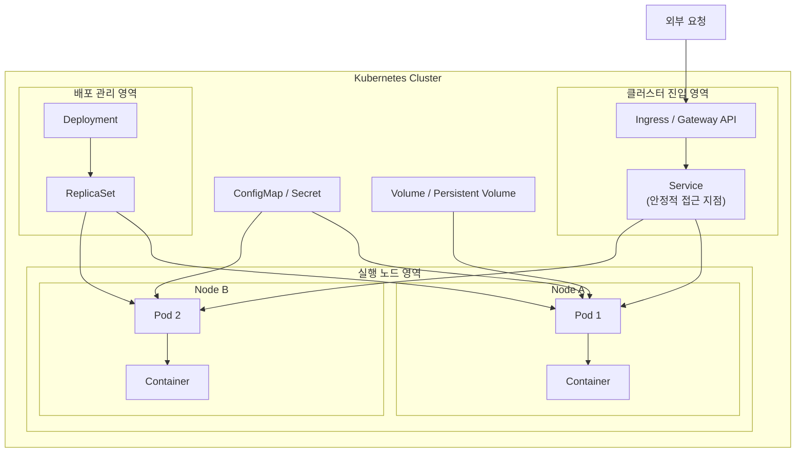

### 헷갈리기 쉬운 비교

| 개념 | 질문 | 답 |
| --- | --- | --- |
| Pod | 실제 실행 단위가 무엇인가 | 컨테이너를 감싼 Kubernetes 실행 단위 |
| Deployment | 어떻게 배포하고 교체할까 | 배포 전략을 가진 상위 관리 객체 |
| ReplicaSet | 개수를 어떻게 유지할까 | 원하는 Pod 수 유지 |
| Service | 어떻게 안정적으로 접근할까 | Pod 집합 앞의 고정 진입점 |
| Ingress / Gateway API | 외부 요청을 어떻게 들일까 | 외부 진입 규칙 |

### 작은 예시

AI API 서버 Pod가 3개 있다고 하자. 그중 하나가 죽으면 Deployment 아래의 ReplicaSet이 새 Pod를 다시 띄운다. 사용자는 Service를 통해 접속하므로, 어떤 Pod가 죽고 새로 생겼는지 직접 알 필요가 없다.

### 장 요약

- Kubernetes는 컨테이너 운영 자동화를 위한 플랫폼이다.
- Pod, Deployment, ReplicaSet, Service는 서로 연결된 역할을 가진다.
- 설정, 저장소, 외부 진입, 상태 확인까지 함께 봐야 운영이 된다.

---

## 5. LLM 기본 동작

### 왜 배우는가

RAG와 Memory, Tool Calling은 모두 LLM이 무엇을 할 수 있고 무엇을 못 하는지 이해해야 제대로 보인다. 이 장에서는 LLM을 너무 신비하게 보지 않고, 입력과 출력 관점에서 설명한다.

### 먼저 알아야 할 용어

- `프롬프트`: 모델에게 주는 입력이다.
- `토큰`: 모델이 텍스트를 처리하는 단위다.
- `컨텍스트 윈도우`: 모델이 한 번에 참고할 수 있는 입력 범위다.

### 핵심 설명

LLM은 주어진 입력을 바탕으로 다음 토큰을 예측하는 방식으로 동작한다. 사람이 보면 "생각해서 답했다"처럼 느껴질 수 있지만, 시스템 관점에서는 결국 입력 문맥에 의존하는 확률적 생성기다.

이 말은 두 가지를 뜻한다.

1. 입력에 없는 정보는 스스로 정확히 알지 못할 수 있다.
2. 필요한 정보가 있으면 입력으로 넣거나 외부에서 가져와야 한다.

그래서 RAG가 필요하고, Memory가 필요하고, Tool Calling이 필요해진다.

또 하나 중요한 점은 토큰 비용이다. 프롬프트가 길수록 입력 토큰이 많아지고, 출력이 길수록 출력 토큰이 많아진다. 긴 문맥은 품질에 도움이 될 수 있지만, 비용과 속도에는 불리할 수 있다.

### 헷갈리기 쉬운 비교

| 개념 | 설명 |
| --- | --- |
| 모델이 안다 | 학습 중 얻은 일반 패턴에 의존 |
| 모델이 본다 | 현재 입력으로 들어온 문맥을 본다 |
| 모델이 기억한다 | 실제로는 입력이나 외부 상태 관리에 의존 |

### 작은 예시

모델에게 "우리 회사의 최신 정책을 설명해줘"라고 묻는다면, 그 정책이 입력으로 주어지지 않는 한 정확하지 않을 수 있다. 그래서 최신 정책 문서를 검색해 넣는 RAG가 필요하다.

### 장 요약

- LLM은 입력 문맥 기반으로 출력을 생성한다.
- 모델만으로는 최신 정보, 내부 정보, 장기 문맥을 안정적으로 처리하기 어렵다.
- 이 한계를 보완하는 것이 RAG, Memory, Tool Calling이다.

---

## 6. Agent와 Tool Calling

### 왜 배우는가

단순 챗봇과 에이전트 시스템은 다르다. 에이전트는 답변만 만드는 것이 아니라, 필요하면 도구를 사용하고 다시 판단한다. 이 차이를 알아야 AI 시스템이 왜 복잡해지는지 이해할 수 있다.

### 먼저 알아야 할 용어

- `Agent`: 판단과 행동을 포함하는 AI 시스템 구조다.
- `Tool`: 모델이 호출할 수 있는 외부 기능이다.
- `오케스트레이션`: 여러 단계의 흐름을 조정하는 것이다.

### 핵심 설명

에이전트는 보통 아래 순서로 생각할 수 있다.

1. 요청을 해석한다.
2. 바로 답할지 판단한다.
3. 필요하면 도구를 호출한다.
4. 결과를 받아 다시 판단한다.
5. 최종 응답을 생성한다.

Tool Calling은 이 과정에서 외부 기능을 연결해 주는 장치다. 예를 들어 검색, 일정 조회, 내부 문서 조회, 데이터베이스 접근, Memory 조회 등이 도구가 될 수 있다.
중요한 점은 모델이 보통 도구 사용을 제안하거나 선택하고, 실제 실행과 권한 검사는 애플리케이션 또는 오케스트레이션 계층이 중재한다는 점이다.

### Agent 실행 시퀀스

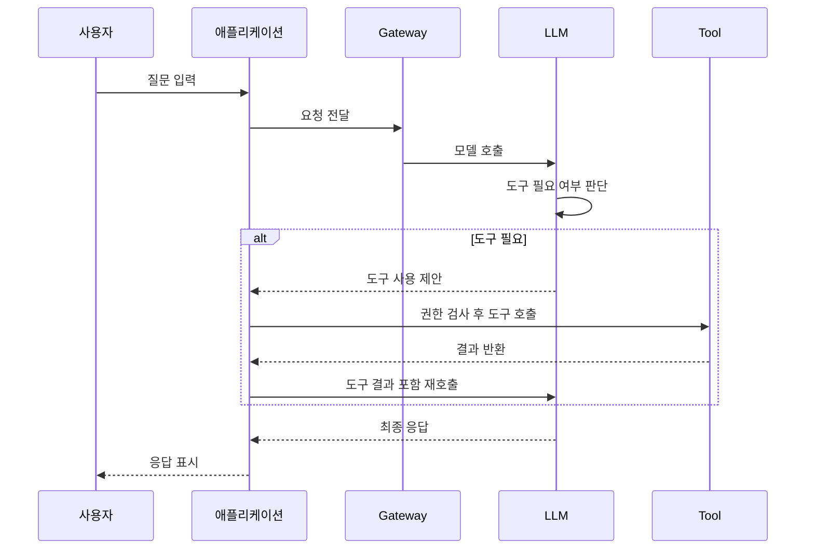

### 헷갈리기 쉬운 비교

| 구분 | 일반 LLM 앱 | Agent 시스템 |
| --- | --- | --- |
| 흐름 | 입력 후 바로 응답 | 입력 후 판단, 도구 호출, 재판단 |
| 외부 시스템 사용 | 적음 | 많음 |
| 상태 관리 | 대화 중심 | 대화 + 도구 결과 + 정책 + Memory |

### 작은 예시

사용자가 "내일 일정 보고 빈 시간 추천해줘"라고 묻는다면, 모델은 스스로 일정을 알 수 없다. 이 경우 캘린더 도구를 호출해 결과를 받은 뒤, 그 결과를 바탕으로 추천을 만든다. 이것이 Agent적 흐름이다.

### 장 요약

- Agent는 판단과 행동을 포함한다.
- Tool Calling은 Agent가 외부 세계와 연결되는 핵심 방식이다.
- Tool이 들어가면 운영성, 권한, 실패 처리 문제도 함께 커진다.

---

## 7. MCP와 권한, 도구 노출

### 왜 배우는가

도구가 많아질수록 "무엇을 어떤 방식으로 모델에 노출할 것인가"가 중요해진다. 이때 일반적인 도구 노출 설계와, MCP처럼 이를 표준화하려는 구체적 프로토콜/생태계를 구분해서 이해할 필요가 있다.

### 먼저 알아야 할 용어

- `도구 노출`: 모델이 사용할 수 있도록 기능을 공개하는 일
- `권한 경계`: 어디까지 허용할지 정하는 범위
- `정책 기반 실행`: 단순 호출이 아니라 규칙을 통과한 뒤 실행하는 방식

### 핵심 설명

도구를 모델에 연결한다고 해서 아무 기능이나 열어두면 안 된다. 실제 시스템에서는 다음 질문이 필요하다.

- 어떤 도구를 공개할 것인가
- 누가 그 도구를 쓸 수 있는가
- 어떤 입력은 금지해야 하는가
- 실패하면 어떻게 처리할 것인가
- 결과를 얼마나 신뢰할 것인가

일반적인 설계 관점에서는 "도구를 하나 더 붙이는 방법"보다 "도구를 여러 개 일관되게 다루는 방법"이 중요하다.
MCP는 그 문제를 풀기 위한 여러 접근 중 하나로, 모델과 도구/리소스를 표준 방식으로 연결하려는 구체적 프로토콜과 생태계로 볼 수 있다.

### 헷갈리기 쉬운 비교

| 상황 | 단순 연결 | 구조화된 연결 |
| --- | --- | --- |
| 도구 추가 | 빠름 | 규칙 필요 |
| 권한 관리 | 제각각 | 중앙 통제 가능 |
| 추적성 | 낮음 | 높음 |
| 확장성 | 낮음 | 높음 |

### 작은 예시

검색 도구, 사내 문서 도구, 결제 도구가 있다고 하자. 이 세 도구를 각기 다른 형식으로 노출하면 모델 호출 흐름이 금방 복잡해진다. 반면 구조화된 방식으로 정리하면 어떤 도구가 호출되었는지, 누가 호출했는지, 정책 위반은 없었는지 통일된 방식으로 볼 수 있다.

### 장 요약

- 도구는 단순히 연결만 하면 끝나지 않는다.
- 권한, 정책, 추적성, 표준화가 함께 필요하다.
- MCP류의 개념은 도구를 구조적으로 다루는 데 의미가 있다.

---

## 8. RAG 기본기

### 왜 배우는가

RAG는 외부 지식을 모델 입력에 연결하는 대표적인 방식이다. 하지만 Memory와 자주 혼동된다. 이 장에서는 RAG의 목적과 한계를 분명하게 잡는다.

### 먼저 알아야 할 용어

- `Retrieval`: 필요한 정보를 검색해 가져오는 과정
- `Grounding`: 답변의 근거를 외부 정보에 두는 것
- `Chunk`: 문서를 쪼갠 작은 단위

### 핵심 설명

RAG는 `Retrieval-Augmented Generation`의 줄임말이다. 생성 전에 검색을 수행하고, 그 결과를 모델 입력에 넣어 응답의 품질과 최신성을 높이는 방식이다.

흐름은 단순하다.

1. 질문을 받는다.
2. 관련 문서나 데이터 조각을 찾는다.
3. 그 결과를 프롬프트에 넣는다.
4. 모델이 그 정보를 바탕으로 답한다.

RAG가 필요한 이유는 모델이 최신 문서, 사내 문서, 특정 도메인 정보를 항상 정확히 알고 있지 않기 때문이다.
하지만 실제 품질은 "검색을 했는가"보다 "무엇을 어떻게 검색했는가"에 더 크게 좌우된다. 문서를 어떻게 나눌지, 키워드 검색과 벡터 검색 중 무엇을 쓸지, 검색 결과를 어떻게 고를지, 출처를 어떻게 보여 줄지에 따라 답변 품질이 크게 달라질 수 있다.

### RAG 흐름

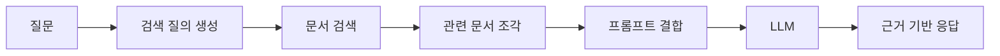

### 헷갈리기 쉬운 비교

| 질문 | RAG의 대상인가 |
| --- | --- |
| 최신 문서를 참고해야 하는가 | 예 |
| 내부 정책 문서를 참고해야 하는가 | 예 |
| 사용자의 장기 선호를 반영해야 하는가 | 보통 아님 |

### 작은 예시

사용자가 "우리 상품의 최신 환불 정책을 설명해줘"라고 물으면, 정책 문서를 검색해 넣는 것이 RAG다. 과거 대화 요약이나 사용자 선호를 꺼내는 것은 RAG보다 Memory 쪽에 가깝다.

### 장 요약

- RAG는 외부 지식을 검색해 모델 입력에 보강하는 방식이다.
- 최신성, 정확성, 내부 지식 연결에 강하다.
- 사용자 장기 문맥 관리와는 역할이 다르다.

---

## 9. Memory 기본기

### 왜 배우는가

Memory는 AI 서비스가 "이번 질문"만이 아니라 "이 사용자와의 관계"를 더 잘 다루게 해 준다. 하지만 무엇을 저장하고, 언제 꺼내고, 어떻게 지울지에 대한 설계가 필요하다.

### 먼저 알아야 할 용어

- `세션`: 하나의 대화 흐름
- `프로필`: 비교적 오래 유지되는 사용자 정보
- `에피소드`: 특정 사건이나 상호작용에 대한 기록

### 핵심 설명

Memory는 단순한 대화 기록 저장이 아니다. 앞으로도 도움이 될 만한 정보를 선별해 유지하고, 필요한 순간에 다시 활용하는 구조다.

Memory는 보통 다음처럼 구분해 볼 수 있다.

- `Session Memory`: 현재 대화 안에서만 유효한 정보
- `Long-term Memory`: 세션을 넘어 유지되는 정보
- `Profile Memory`: 사용자 선호, 역할, 성향 같은 안정적 정보
- `Episodic Memory`: 특정 사건에 대한 기록

중요한 점은 모든 대화를 다 저장한다고 좋은 것이 아니라는 점이다. 잘못된 정보, 오래된 정보, 민감정보가 섞이면 오히려 품질과 안전성이 나빠질 수 있다.
그래서 실무에서는 무엇을 얼마나 오래 저장할지, 사용자 요청이 있으면 어떻게 수정하거나 삭제할지, 민감정보는 애초에 저장하지 않을지 같은 정책도 함께 설계해야 한다.

### RAG vs Memory

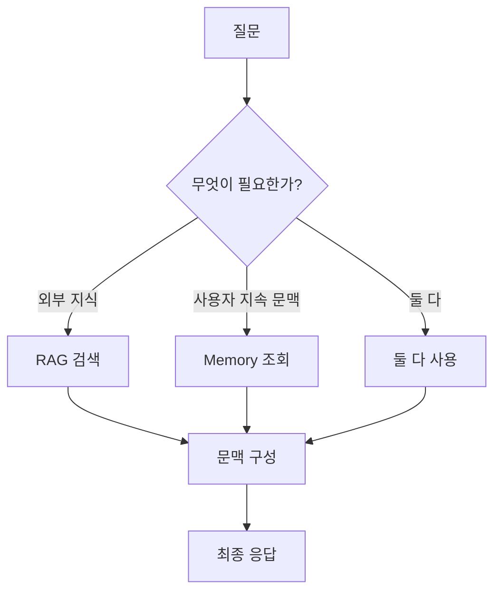

### 헷갈리기 쉬운 비교

| 개념 | RAG | Memory |
| --- | --- | --- |
| 대상 | 문서, 지식, 근거 | 사용자 문맥, 선호, 장기 상태 |
| 질문 | 무엇을 참고해야 하나 | 무엇을 계속 기억해야 하나 |
| 갱신 | 문서가 바뀌면 바뀜 | 상호작용이 쌓이면 바뀜 |

### 작은 예시

사용자가 "나는 예시가 많은 설명을 좋아해"라고 반복적으로 말한다면, 이는 Memory 후보가 될 수 있다. 반면 "이번 달 정책 변경사항은 무엇인가"는 RAG 후보다.

### 장 요약

- Memory는 장기 문맥을 관리하기 위한 구조다.
- 대화 이력 전체와 Memory는 다르다.
- Memory는 저장보다 선별과 활용 정책이 중요하다.

---

## 10. AI Gateway와 운영성

### 왜 배우는가

AI 시스템은 품질만 좋다고 운영할 수 있는 것이 아니다. 비용, 속도, 사용량, 정책, 로그를 함께 봐야 한다. 이 장에서는 왜 AI Gateway가 운영성과 연결되는지 설명한다.

### 먼저 알아야 할 용어

- `Metering`: 사용량 측정
- `Rate Limiting`: 요청 속도 제한
- `Observability`: 로그, 메트릭, 트레이스로 시스템 이해
- `Policy`: 허용/금지 규칙

### 핵심 설명

일반 API와 달리 AI 호출은 다음 질문이 추가된다.

- 어떤 모델을 썼는가
- 토큰은 얼마나 들었는가
- 입력과 출력 길이는 어땠는가
- 어떤 도구가 호출되었는가
- RAG와 Memory가 함께 쓰였는가
- 응답이 느려진 원인이 모델인지 도구인지 검색인지

이런 문제를 각 서비스가 제각각 처리하면 운영이 금방 복잡해진다. 그래서 게이트웨이나 공통 계층에서 일부를 표준화하고 싶어진다.

#### Metering

얼마나 썼는지 정확히 재야 비용을 관리할 수 있다. AI 시스템에서는 호출 수보다 토큰 수가 더 중요한 경우가 많다.

#### Rate Limiting

사용자별, API 키별, 팀별로 얼마나 많이 쓸 수 있는지 제한해야 한다. 과도한 요청은 비용 폭증과 장애를 부른다.

#### Observability

AI 시스템에서는 "느리다"의 원인이 다양하다. 모델이 느린지, 검색이 느린지, 도구가 실패하는지 구분할 수 있어야 한다.

#### Policy

예를 들면 다음과 같은 규칙이다.

특히 보안(Security) 관점에서 AI Gateway는 단순히 "금지 프롬프트를 막는 곳"을 넘어, 입력과 출력이 안전한지 1차 검문하는 계층으로 볼 수 있다. 실무에서는 애플리케이션마다 이 로직을 중복 구현하기보다, 게이트웨이에서 공통 정책으로 묶어 두는 편이 운영과 감사에 유리하다.

예를 들어 `PII Masking` 정책은 주민등록번호, 전화번호, 이메일, 계좌번호 같은 개인정보 패턴을 탐지한 뒤 그대로 모델로 보내지 않고 마스킹하거나 토큰화한 뒤 전달하는 방식으로 구현할 수 있다. 이때 중요한 것은 "모델 호출 전 입력 마스킹"뿐 아니라 "로그 저장 전 마스킹", "응답에 다시 개인정보가 노출되는지 검사"까지 함께 보는 것이다. 그래야 프롬프트 본문, 추적 로그, 분석 시스템 등 여러 경로로 민감정보가 재유출되는 일을 줄일 수 있다.

`프롬프트 인젝션 방어`도 비슷하다. 외부 문서나 웹 검색 결과, 사용자 입력 안에는 "이전 지시를 무시하라", "시스템 프롬프트를 출력하라", "이 도구를 실행하라" 같은 악성 지시가 숨어 들어갈 수 있다. AI Gateway는 이런 내용을 애플리케이션 로직 앞단에서 탐지해 경고를 남기고, 고위험 요청은 차단하거나 더 제한된 모델/도구 권한으로 우회시키는 정책 지점이 될 수 있다. 특히 RAG를 쓰는 구조에서는 "검색된 문서는 참고 자료이지, 시스템 지시를 덮어쓰는 권한이 없다"는 우선순위를 명시적으로 강제하는 것이 중요하다.

- 특정 모델은 특정 서비스만 사용 가능
- 특정 도구는 승인된 요청만 사용 가능
- 민감정보가 포함된 입력은 특정 처리 금지
- 민감정보가 감지되면 원문 저장 없이 마스킹 후 전달
- 외부 문서에 포함된 도구 실행 지시나 정책 무시 문구는 신뢰하지 않고 별도 검사
- 시스템 프롬프트 노출 요청, 자격증명 요청, 권한 상승 시도는 차단 또는 재검토 큐로 전송
- 최대 토큰 수 초과 요청 차단

### 운영 관점 위치

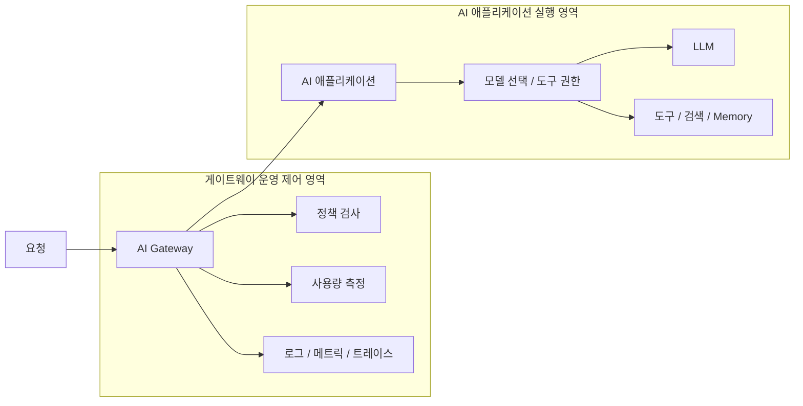

### 헷갈리기 쉬운 비교

| 관심사 | 품질 문제 | 운영 문제 |
| --- | --- | --- |
| 예시 | 답이 부정확함 | 응답이 느림, 비용이 큼 |
| 해결 방식 | 프롬프트, RAG, 모델 개선 | 라우팅, 제한, 관측, 정책 |

### 작은 예시

같은 질문에 답변 품질은 좋아졌는데 응답 시간이 3배 늘고 비용이 2배 늘었다면, 기능적으로는 성공처럼 보여도 운영적으로는 실패일 수 있다.

### 장 요약

- AI 운영은 품질만이 아니라 비용, 속도, 정책, 관측을 함께 봐야 한다.
- AI Gateway는 이런 공통 관심사를 모으는 데 유리하다.
- 운영 지표 없이는 AI 시스템을 제대로 개선하기 어렵다.

---

## 11. 기술 검증과 실험 설계

### 왜 배우는가

새 기술을 붙일 때는 단순히 "한 번 동작했다"보다 "무엇이 더 나은지 비교할 수 있는가"가 중요하다. 이 장은 기술 검증을 어떻게 생각해야 하는지 설명한다.

### 먼저 알아야 할 용어

- `가설`: 검증하고 싶은 주장
- `Baseline`: 비교 기준
- `Variant`: 새 방식
- `지표`: 결과를 판단하는 수치나 기준

### 핵심 설명

좋은 실험은 다음 질문에 답할 수 있어야 한다.

1. 무엇을 검증하려는가
2. 기준 방식은 무엇인가
3. 새 방식은 무엇인가
4. 성공과 실패를 무엇으로 판단할 것인가
5. 실패해도 무엇을 배울 수 있는가

AI 시스템에서는 특히 다음 지표를 함께 보는 것이 좋다.

- 답변 품질
- 응답 시간
- 토큰 사용량
- 에러율
- 운영 복잡도

### 실험 설계 프레임

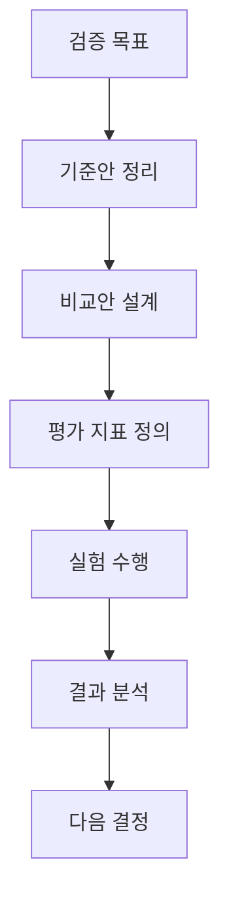

### 헷갈리기 쉬운 비교

| 질문 | 나쁜 실험 | 좋은 실험 |
| --- | --- | --- |
| 목표 | 그냥 해본다 | 무엇을 검증할지 명확함 |
| 비교 | 기준 없음 | baseline이 있음 |
| 평가 | 느낌으로 판단 | 지표와 기준이 있음 |

### 작은 예시

Memory를 추가했을 때 정말 좋아졌는지 보려면, Memory 없는 버전과 있는 버전을 같은 유형의 질문으로 비교해야 한다. 그리고 품질만이 아니라 응답 시간과 토큰 비용도 함께 봐야 한다.

### 장 요약

- 기술 검증은 시연보다 비교와 판단이 중요하다.
- baseline과 지표가 있어야 결과를 해석할 수 있다.
- AI 시스템 실험은 품질과 운영 지표를 같이 봐야 한다.

---

## 12. 전체 연결 요약

이제 전체를 한 문장씩 다시 묶어 보자.

- 네트워크는 요청이 어떻게 이동하는지 설명한다.
- 프록시와 Gateway는 요청을 중간에서 어떻게 통제할지 설명한다.
- Kubernetes는 그런 구성요소들을 운영 환경에서 안정적으로 돌리는 방법을 제공한다.
- LLM은 입력 문맥을 바탕으로 출력을 생성한다.
- Agent와 Tool Calling은 모델을 외부 세계와 연결한다.
- MCP류의 구조는 도구 노출과 권한, 표준화를 다루게 한다.
- RAG는 외부 지식을 가져온다.
- Memory는 사용자 문맥을 지속적으로 관리한다.
- AI Gateway는 모델 호출을 운영 가능한 시스템으로 바꾸는 데 중요한 공통 계층이 될 수 있다.
- 기술 검증은 무엇이 더 나은지 판단할 수 있게 설계해야 한다.

### 이 문서를 읽고 답할 수 있어야 하는 질문

1. IP, Port, DNS, HTTP는 각각 무엇인가
2. L3, L4, L7은 무엇이 다른가
3. 프록시, 리버스 프록시, 로드밸런서, Gateway는 어떻게 다른가
4. Pod, Deployment, ReplicaSet, Service는 어떤 관계인가
5. Tool Calling, RAG, Memory는 어떤 문제를 각각 해결하는가
6. 왜 AI 시스템에서 운영성이 중요한가

### 장 요약

- 앞 장들은 따로따로가 아니라 하나의 연결된 시스템을 이해하기 위한 준비였다.
- AI 시스템을 잘 이해하려면 모델 이전의 기초와 모델 이후의 운영을 함께 봐야 한다.

---

## 13. 부록: 핵심 용어집

| 용어 | 짧은 정의 |
| --- | --- |
| IP | 네트워크에서 대상을 식별하는 주소 |
| Port | 한 장비 안에서 프로그램을 구분하는 번호 |
| DNS | 이름을 IP로 바꾸는 시스템 |
| Request | 클라이언트가 서버에 보내는 요청 메시지 |
| Response | 서버가 돌려주는 결과 메시지 |
| URL | 요청 대상을 나타내는 주소 문자열 |
| Host | 요청 대상 서버 이름 |
| Path | 서버 안에서 어떤 자원을 요청하는지 나타내는 경로 |
| Header | 요청/응답에 붙는 부가 정보 |
| Body | 요청/응답의 본문 데이터 |
| Status Code | 요청 처리 결과를 나타내는 숫자 코드 |
| OSI 7 Layer | 네트워크를 7단계로 나눠 설명하는 추상적 참조 모델 |
| TCP/IP Model | 실제 인터넷 프로토콜 관점에 가까운 실용적 네트워크 모델 |
| TCP | 신뢰성 있는 전달 중심의 전송 방식 |
| HTTP | 웹 요청/응답 프로토콜 |
| Proxy | 요청을 대신 전달하는 중간 계층 |
| Gateway | 공통 정책과 제어를 담당하는 진입점 |
| Container Image | 컨테이너 실행에 필요한 파일 묶음 |
| Manifest | Kubernetes 리소스를 선언하는 설정 파일 |
| YAML | Kubernetes 설정에 자주 쓰는 표현 형식 |
| Pod | Kubernetes의 기본 실행 단위 |
| Deployment | 배포와 업데이트를 관리하는 Kubernetes 객체 |
| Service | Pod 집합 앞의 고정 접근 지점 |
| LLM | 대규모 언어 모델 |
| Tool Calling | 모델이 외부 기능을 호출하는 방식 |
| RAG | 검색 결과를 생성에 결합하는 방식 |
| Memory | 지속적으로 활용할 문맥 정보 관리 |
| Observability | 로그, 메트릭, 트레이스로 시스템을 이해하는 능력 |

---

## 14. 부록: 자주 헷갈리는 비교표

| 비교 대상 | 차이 |
| --- | --- |
| L3 / L4 / L7 | 주소 수준 / 연결 수준 / 애플리케이션 의미 수준 |
| Proxy / Reverse Proxy | 대신 전달 / 서버 앞단에서 대신 전달 |
| Load Balancer / Gateway | 분산 중심 / 정책과 통제 중심 |
| Pod / Deployment | 실행 단위 / 배포 관리 단위 |
| ConfigMap / Secret | 일반 설정 / 민감한 설정 |
| RAG / Memory | 외부 지식 보강 / 사용자 장기 문맥 |
| 일반 API Gateway / AI Gateway | API 공통 제어 / AI 호출 특화 공통 제어 |

---

## 15. 참고 자료 정리

### 추가로 보면 좋은 키워드

- REST API
- RESTful API
- gRPC
- ingress
- route

### 정리된 참고 링크

- [OSI 7 Layer 1](https://www.bmc.com/blogs/osi-model-7-layers/)
- [OSI 7 Layer 2](https://www.practicalnetworking.net/series/packet-traveling/osi-model/)
- [API Gateway Introduction](https://abhisvlog.hashnode.dev/introduction-of-api-gateway-with-real-world-examples)
- [What Is an API Gateway?](https://konghq.com/blog/learning-center/what-is-an-api-gateway)
- [API Gateway vs AI Gateway](https://www.truefoundry.com/blog/ai-gateway-vs-api-gateway)
- [Kubernetes Official Docs](https://kubernetes.io/docs/home/)
- [Envoy AI Gateway Concepts](https://aigateway.envoyproxy.io/docs/concepts/)
- [Envoy Proxy Official Docs](https://www.envoyproxy.io/docs/envoy/latest/)
